# Yoni Das Pretas

O projeto consiste em uma vitrine de profissionais para que interagentes e pessoas interessadas possam se conectar aos seus serviços.

## 🚀 Tecnologias Utilizadas
- [Angular](https://angular.io/)
- [TypeScript](https://www.typescriptlang.org/)
- [NGXBootstrap](https://valor-software.com/ngx-bootstrap/)
- [Boxicons](https://boxicons.com/)

## 📦 Instalação
1. Clonar este repositório:
    ```sh
    git clone https://github.com/Dapomproject/yonidaspretas-frontend.git
    
2. Acesse a pasta do projeto: 
    ```sh
    cd yonidaspretas-frontend

3. Instale as dependências:
    ```sh
    npm install

4. Inicie o servidor de desenvolvimento:
    ```sh
    ng serve

5. Url de navegação:
    ```sh
    http://localhost:4200/

## 🔧 Configuração do Ambiente
* Certifique-se que você tem o Angular CLI instalado (recomenda-se a versão 16+)(https://v16.angular.io/guide/setup-local)    
* Certifique-se de que você tem o Node.js instalado (recomenda-se a versão 16+) (https://nodejs.org/pt).
* Defina variáveis de ambiente no arquivo .environment, se aplicável.

## 📸 Capturas de Tela
#### Login
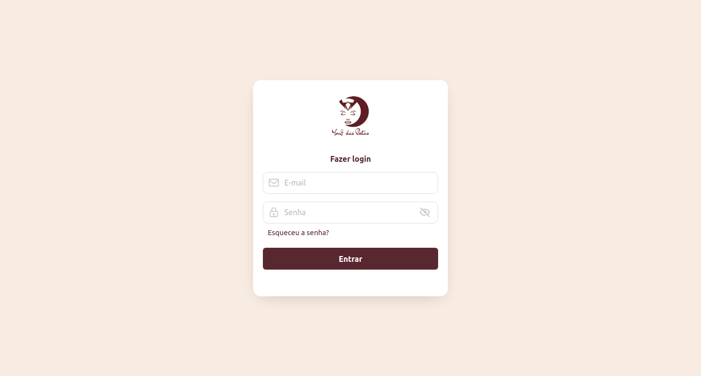

##

#### Recuperação de senha
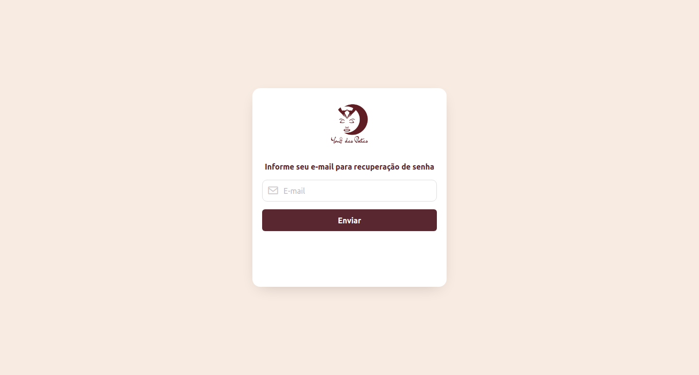

#### Tela principal
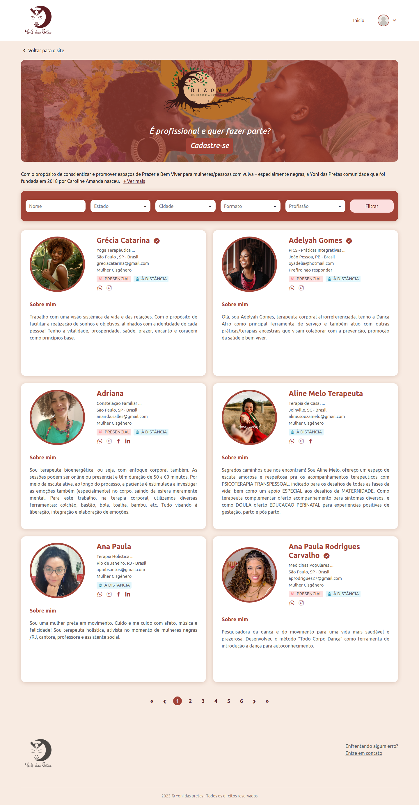

#### Detalhes do profissional
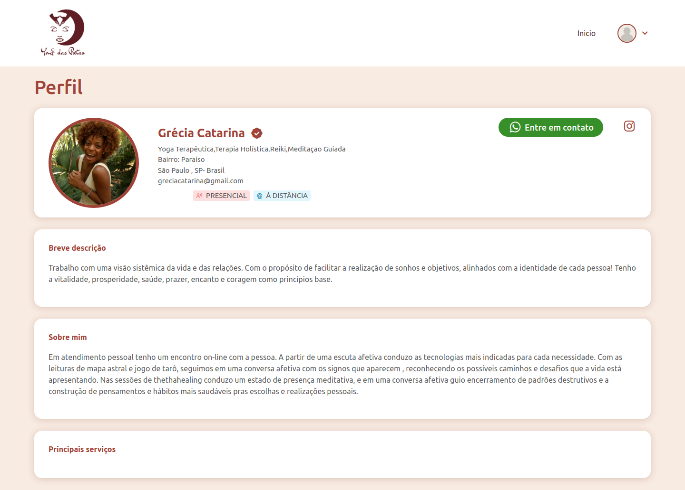

#### Cadastro do profissional
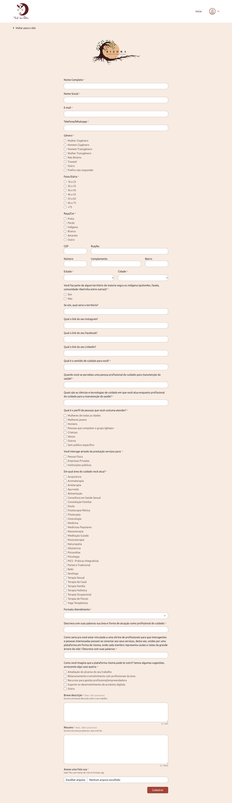

#### Painel administrativo
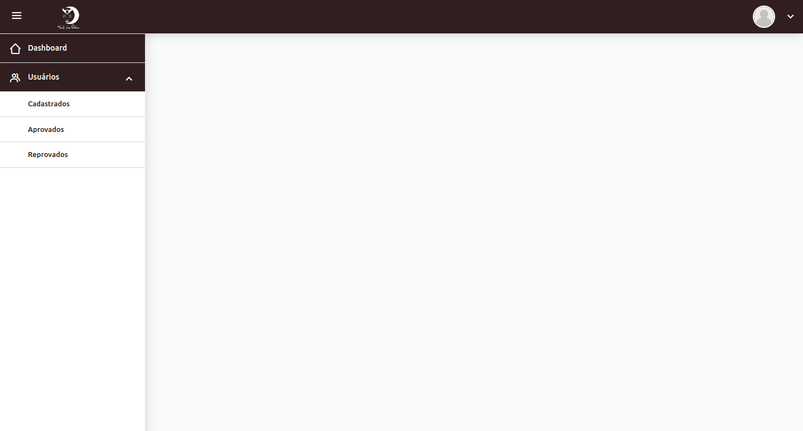

#### Usuarios cadastrados
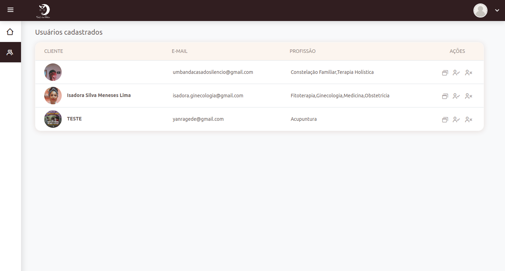

#### Usuarios aprovados
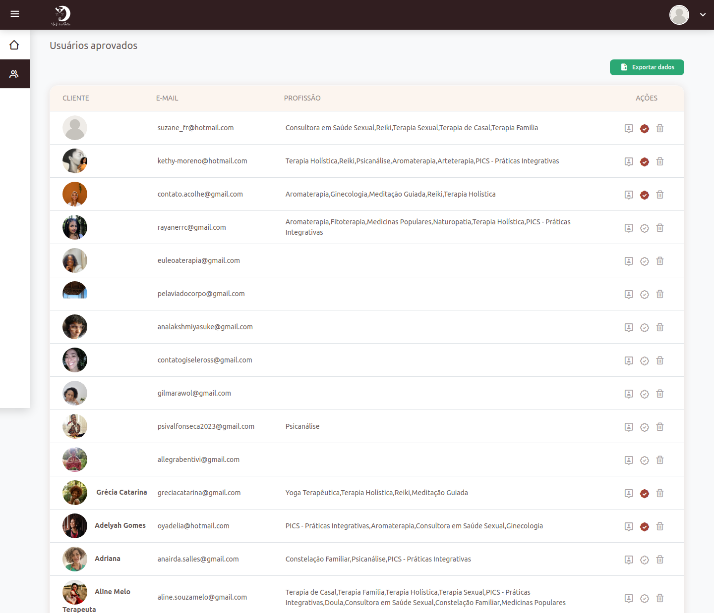

#### Usuarios reprovados
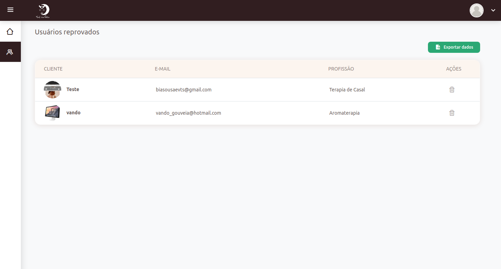

#### Perfil de aprovados
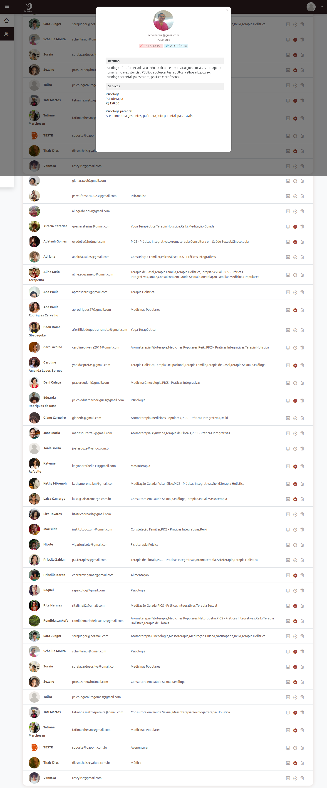

#### Respostas do formulario de cadastro
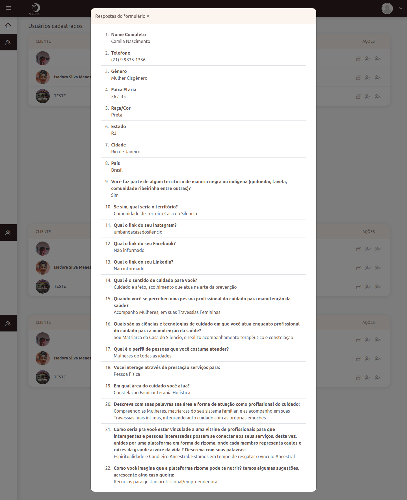

## ✨ Funcionalidades
* Autenticação de usuários (cadastro/login)
* Envio e recebimento de e-mails (cadastro/login/esqueci a senha, aprovação, rejeição)
* Listagem e detalhes de profissionais
* Filtragem por nome, estado, cidade, formato e profissão
* Painel administrativo
* Aprovação ou rejeição de perfis
* Opção para exportação de perfis


## 📄 Licença

Licença Privada - Uso Restrito
Copyright (c) 2025 Dapom Projetos Digitais

1. **Permissões Concedidas:**
   O software pode ser utilizado apenas pela parte licenciada (usuário final, empresa, etc.), e não pode ser redistribuído, sublicenciado, copiado ou modificado de qualquer forma sem a permissão explícita do titular dos direitos autorais.

2. **Uso Permitido:**
   - O software pode ser usado apenas para [especificar o uso permitido, como "uso interno", "para fins educacionais", etc.].
   - O software não pode ser usado para qualquer propósito comercial sem uma licença adicional.

3. **Proibição de Modificação e Distribuição:**
   O software não pode ser modificado, adaptado ou redistribuído, de qualquer forma, sem permissão expressa por escrito.

4. **Responsabilidade e Garantias:**
   O software é fornecido "como está", sem garantia de qualquer tipo, expressa ou implícita, incluindo, mas não se limitando a, garantias de comercialização, adequação a um propósito específico e não violação. O titular dos direitos autorais não será responsável por qualquer dano, seja direto ou indireto, decorrente do uso do software.

5. **Violação da Licença:**
   O uso não autorizado ou a violação de qualquer termo desta licença resultará na revogação imediata da licença de uso e poderá resultar em ações legais.
   
6. **Transferência de Licença:**
   Esta licença não é transferível para outra pessoa ou entidade sem o consentimento prévio por escrito do titular dos direitos autorais.
