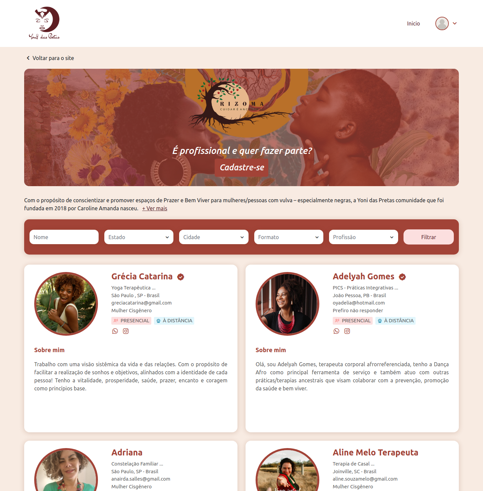

# Yoni Das Pretas

O projeto consiste em uma vitrine de profissionais para que interagentes e pessoas interessadas possam se conectar aos seus serviços.

## 🚀 Tecnologias Utilizadas
- [Angular](https://angular.io/)
- [TypeScript](https://www.typescriptlang.org/)
- [NGXBootstrap](https://valor-software.com/ngx-bootstrap/)
- [Boxicons](https://boxicons.com/)

## 📦 Instalação
1. Clonar este repositório:
    ```sh
    git clone https://github.com/Dapomproject/yonidaspretas-frontend.git
    
2. Acesse a pasta do projeto: 
    ```sh
    cd yonidaspretas-frontend

3. Instale as dependências:
    ```sh
    npm install

4. Inicie o servidor de desenvolvimento:
    ```sh
    ng serve

5. Url de navegação:
    ```sh
    http://localhost:4200/

## 🔧 Configuração do Ambiente
* Certifique-se que você tem o Angular CLI instalado (recomenda-se a versão 16+)(https://v16.angular.io/guide/setup-local)    
* Certifique-se de que você tem o Node.js instalado (recomenda-se a versão 16+) (https://nodejs.org/pt).
* Defina variáveis de ambiente no arquivo .environment, se aplicável.

## 📸 Capturas de Tela
#### Login


##

#### Recuperação de senha


##

#### Tela principal


##

#### Detalhes do profissional


##

#### Cadastro do profissional


##

#### Painel administrativo


##

#### Usuarios cadastrados


##

#### Usuarios aprovados


##

#### Usuarios reprovados


##

#### Perfil de aprovados


##

#### Respostas do formulario de cadastro


## ✨ Funcionalidades
* Autenticação de usuários (cadastro/login)
* Envio e recebimento de e-mails (cadastro/login/esqueci a senha, aprovação, rejeição)
* Listagem e detalhes de profissionais
* Filtragem por nome, estado, cidade, formato e profissão
* Painel administrativo
* Aprovação ou rejeição de perfis
* Opção para exportação de perfis

## 🛠️ Estrutura do Projeto
   ```sh
   ├── dist                                  # Pasta onde o Angular gera os arquivos finais após o build
   ├── src                                   # Código-fonte do projeto
   │   ├── app                               # Diretório principal da aplicação
   │   │   └── modules                       # Módulos da aplicação
   │   │       ├── auth                      # Módulo de autenticação (login, logout, etc.)
   │   │       ├── esqueci-senha             # Módulo para recuperação de senha
   │   │       │   └── services              # Serviços relacionados à recuperação de senha
   │   │       ├── login                     # Módulo de login
   │   │       │   └── services              # Serviços relacionados ao login
   │   │       ├── private                   # Módulo para usuários autenticados (área restrita)
   │   │       │   ├── admin                 # Área administrativa
   │   │       │   ├── layout                # Componentes de layout da área privada
   │   │       │   │   ├── header            # Cabeçalho da área privada
   │   │       │   │   └── sidebar           # Menu lateral da área privada
   │   │       │   ├── services              # Serviços exclusivos da área privada
   │   │       │   ├── usuarios-aprovados    # Tela/lista de usuários aprovados
   │   │       │   ├── usuarios-cadastrados  # Tela/lista de usuários cadastrados
   │   │       │   └── usuarios-reprovados   # Tela/lista de usuários reprovados
   │   │       ├── public                    # Módulo público (acessível sem login)
   │   │       │   ├── form-perguntas        # Página de perguntas (formulário)
   │   │       │   ├── home                  # Página inicial
   │   │       │   ├── home-detalhes         # Detalhes de um item na home
   │   │       │   ├── layout                # Componentes de layout da área pública
   │   │       │   │   ├── footer            # Rodapé do site
   │   │       │   │   └── header            # Cabeçalho da área pública
   │   │       │   ├── services              # Serviços da área pública
   │   │       │   └── usuarios              # Gerenciamento de usuários na área pública
   │   │       │       └── minha-conta       # Página "Minha Conta" do usuário
   │   │       ├── registro                  # Módulo de registro de novos usuários
   │   │       ├── shared                    # Componentes reutilizáveis
   │   │       │   ├── modal                 # Componente de modal genérico
   │   │       │   └── table                 # Componente de tabela genérica
   │   │       └── utils                     # Funções/utilitários reutilizáveis
   │   ├── assets                            # Recursos estáticos do projeto (imagens, fontes, ícones)
   │   │   ├── boxicons-2.1.4                # Ícones utilizados no projeto        
   │   │   └── imgs                          # Imagens utilizadas no projeto
   │   ├── environments                      # Configurações de ambiente (produção, desenvolvimento)
   │   ├── favicon.ico                       # Ícone da aba do navegador
   │   ├── index.html                        # Página HTML principal do projeto
   │   ├── main.ts                           # Arquivo principal que inicia a aplicação Angular
   │   └── styles.scss                       # Estilos globais do projeto
   ├── angular.json                          # Configuração do Angular CLI (builds, assets, etc.)
   ├── package-lock.json                     # Controle das versões exatas das dependências instaladas
   ├── package.json                          # Lista de dependências do projeto e scripts do npm
   ├── README.md                             # Documentação do projeto
   ├── tsconfig.app.json                     # Configuração TypeScript específica para a aplicação Angular
   ├── tsconfig.json                         # Configuração principal do TypeScript
   └── tsconfig.spec.json                    # Configuração TypeScript para testes unitários

```
  
## 📄 Licença

Licença Privada - Uso Restrito
Copyright (c) 2025 Dapom Projetos Digitais

1. **Permissões Concedidas:**
   O software pode ser utilizado apenas pela parte licenciada (usuário final, empresa, etc.), e não pode ser redistribuído, sublicenciado, copiado ou modificado de qualquer forma sem a permissão explícita do titular dos direitos autorais.

2. **Uso Permitido:**
   - O software pode ser usado apenas para [especificar o uso permitido, como "uso interno", "para fins educacionais", etc.].
   - O software não pode ser usado para qualquer propósito comercial sem uma licença adicional.

3. **Proibição de Modificação e Distribuição:**
   O software não pode ser modificado, adaptado ou redistribuído, de qualquer forma, sem permissão expressa por escrito.

4. **Responsabilidade e Garantias:**
   O software é fornecido "como está", sem garantia de qualquer tipo, expressa ou implícita, incluindo, mas não se limitando a, garantias de comercialização, adequação a um propósito específico e não violação. O titular dos direitos autorais não será responsável por qualquer dano, seja direto ou indireto, decorrente do uso do software.

5. **Violação da Licença:**
   O uso não autorizado ou a violação de qualquer termo desta licença resultará na revogação imediata da licença de uso e poderá resultar em ações legais.
   
6. **Transferência de Licença:**
   Esta licença não é transferível para outra pessoa ou entidade sem o consentimento prévio por escrito do titular dos direitos autorais.
